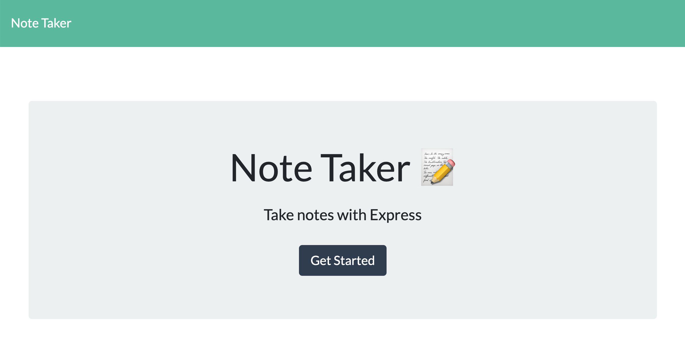
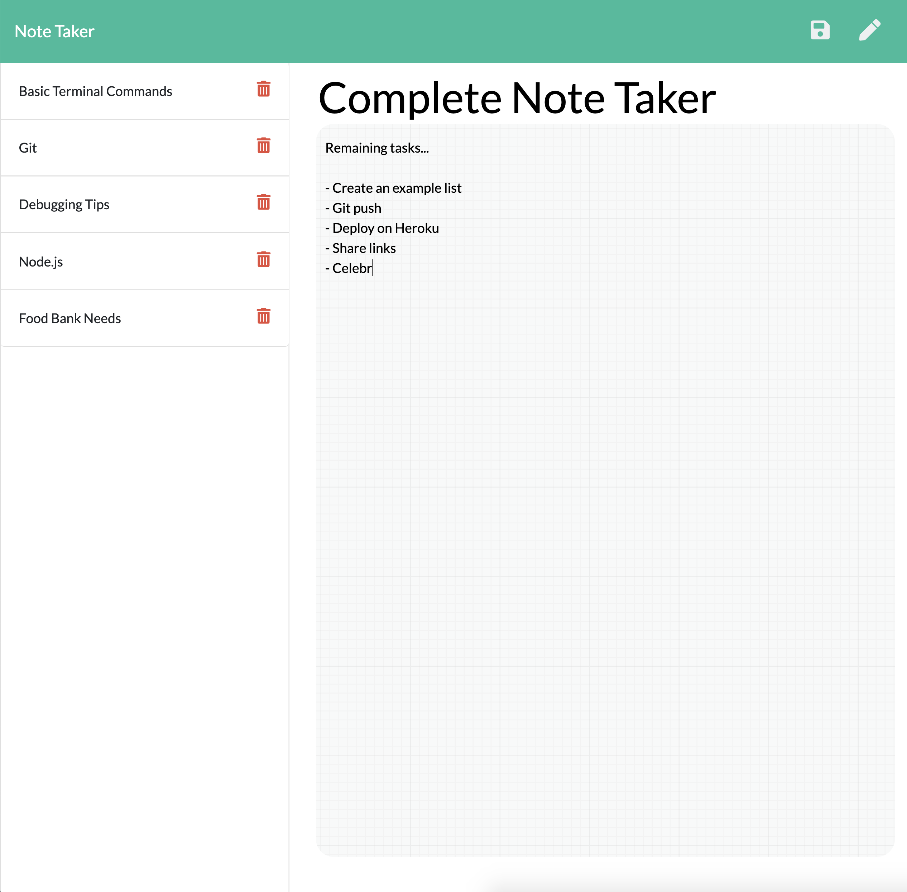

# Note Taker Express 
  Note Taker Express is an application that can be used to write, save and delete notes all made possible by an express backend. The application is simple and easy to use and takes the away the worry of forgetting important notes by utilizing the backend server.
  ## Table of Contents
  1. [Installation](#Installation)
  2. [Usage](#Usage)
  3. [Contributing](#Contributing)
  4. [Tests](#Tests)
  5. [License](#License)
  6. [Questions](#Questions)
  ## Installation
       To develop: 
       $ npm install 

       To use: 
       No installation required
  ## Usage
  The app is meant to be used by anyone who wants to save important notes and reminders, keeping track of their important information. It is a simple write, save and delete application that can be used for study notes, shopping lists, idea journals and more.
  ## Contributing
  Feel free to contribute but comment and commit often to keep track of additions and ensure a working application.
  ## Tests
       No test instructions.
  ## License
  >BSD 
  ## Questions

  * GitHub: [VinAVarghese](https://github.com/VinAVarghese)
  * Email: [VinAVarghese@gmail.com](mailto:VinAVarghese@gmail.com)
  
  Feel free to reach out with any questions by emailing be with a subject line of...  RE:NoteTakerExpress

  ## Links/Images
  
  
